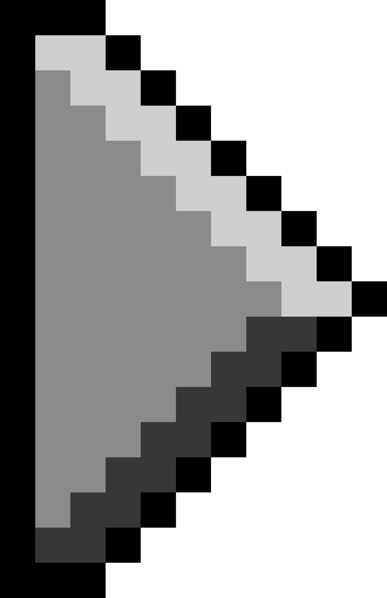
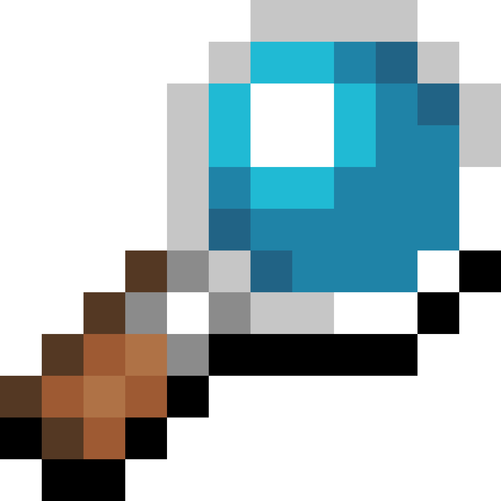
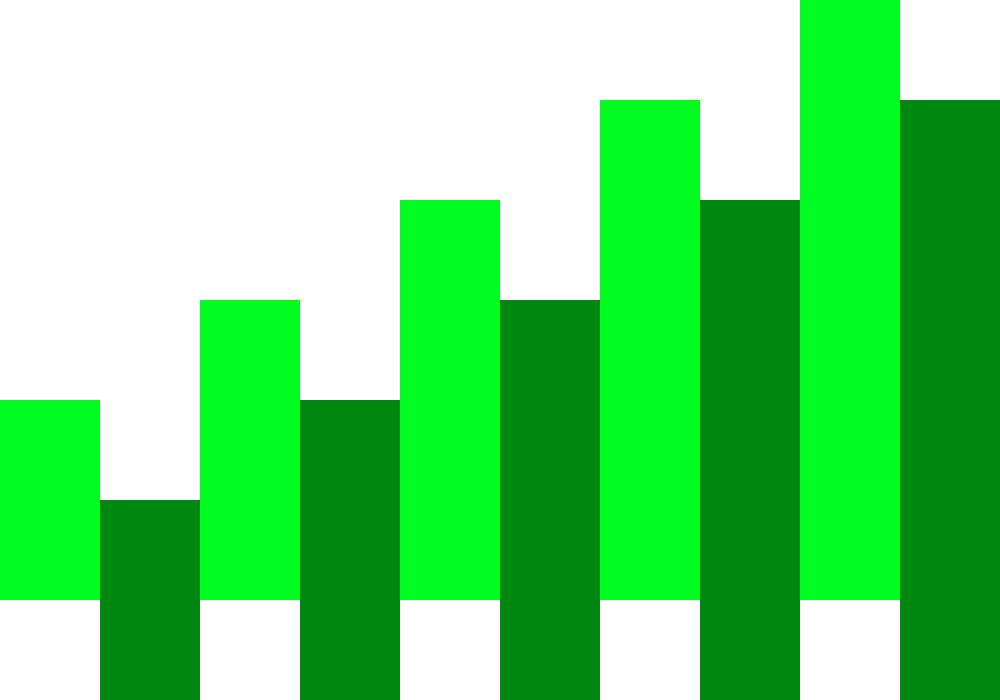

```text
 _   _      _ _         __        __         _     _ _
| | | | ___| | | ___    \ \      / /__  _ __| | __| |
| |_| |/ _ \ | |/ _ \    \ \ /\ / / _ \| '__| |/ _` |
|  _  |  __/ | | (_) |    \ V  V / (_) | |  | | (_| |
|_| |_|\___|_|_|\___/      \_/\_/ \___/|_|  |_|\__,_|
```

### Stack

<p align="left">
  <a href="https://skillicons.dev">
    
  </a>
</p>
<p align="left">
  <a href="https://skillicons.dev">
    
  </a>
</p>

 Backend developer

 DX developer

 Game-dev

### About me

 **Skills:** Kotlin, Lua, JavaScript

 **Age:** 16

 **Color:** Orange, Purple

 **Active:** Rarely

# Now work with
<p align="center">
  <a href="https://github.com/Karasichek/Tgxiki"></a>&nbsp;&nbsp;
  <a href="https://github.com/Karasichek/filament"></a>
</p>
